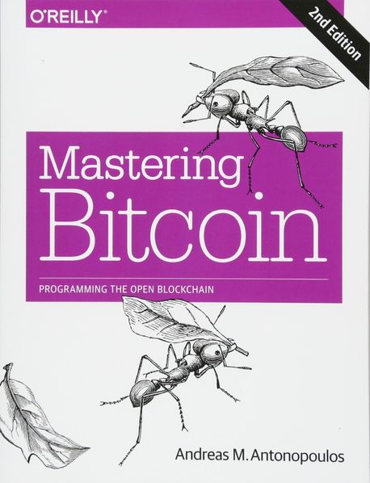
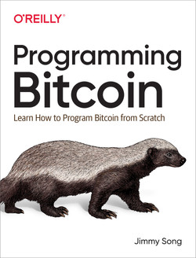

# 🏔️ 비트코인 한걸음

> 개발자를 위한 나노 단위 비트코인 해설서

  

# 📖 주 교재

- [Andreas M. Antonopoulos, ”Mastering Bitcoin”](https://github.com/bitcoinbook/bitcoinbook)
- [Jimmy Song, “Programming Bitcoin”](https://github.com/jimmysong/programmingbitcoin/tree/master)
  

# 🎹 목록
## I. 키와 주소

[1. 유한체](./1_1_Finite_Field.md)

[2. 타원곡선](https://www.notion.so/65f6cb5e9d0c4d31b92b465decdb28b0?pvs=21)

[3. 타원곡선 암호](https://www.notion.so/ce1e11f1888f48dabbe7a7bb2c923c64?pvs=21)

[4. 개인키과 공개키](https://www.notion.so/fee6d739d6ea4baea197cef2ea25e733?pvs=21)

[5. 비트코인의 키와 주소](https://www.notion.so/7cafd0cdd4964216b1811beb5e7bc2e1?pvs=21)

[6. 지갑](https://www.notion.so/a6371193ee3c4832b7e5359dac2e0351?pvs=21)

## II. 트랜잭션과 스크립트

[1. 입력과 출력](https://www.notion.so/2378b6474a4740c8a2fede451a541544?pvs=21)

[2. 스크립트](https://www.notion.so/5a691b85488a4d868d1af56a32a22631?pvs=21)

[3. 트랜잭션](https://www.notion.so/8e6ad5d3e8584c708dd07b040cbef45e?pvs=21)

[4. 다중서명](https://www.notion.so/0698482ac5814092bddab7908bdac29c?pvs=21)

[5. 세그윗](https://www.notion.so/0e1435e88f2f43fc982470130fc9cca1?pvs=21)

## III. 블록체인과 합의

[1. 블록체인](https://www.notion.so/d11fa00b6faf41219a9966742f8e065f?pvs=21)